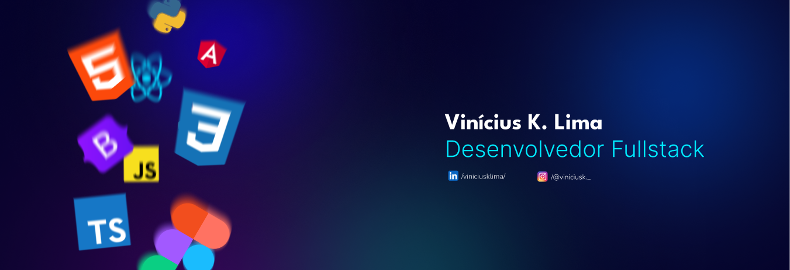

  

## 🛠️Skills:

  
  
  
  
  
  
  
  

## 👤Sobre mim:
- 👋 Prazer, me chamo Vinícius! Estou cursando de Ciência da Computação na Estácio do Recife e tenho um grande interesse pelo universo da tecnologia. Estou sempre em busca de novos aprendizados na área de programação e desenvolvimento de software, me desafiando constantemente a evoluir, superar limites e me dedicar cada vez mais àquilo que gosto de fazer.

- 👨‍💻Ando focado em aprimorar minhas habilidades em desenvolvimento front-end, explorando também o universo do back-end e me envolvendo em projetos voltados para o desenvolvimento mobile. Busco sempre aprender com foco e empenho, explorando novas tecnologias e práticas que me ajudem a evoluir como desenvolvedor.

- 🎭Além de programar, tenho uma enorme paixão por cinema! Adoro entender os detalhes que fazem cada filme único e especial. Também sou apaixonado por livros, acredito que eles são como a bateria que impulsiona o cérebro, sempre ampliando nossos horizontes. Outro grande interesse meu é a fotografia e edição de imagens, onde busco transmitir visões do mundo e expressar sentimentos através da lente de uma câmera.

- 💡Estou disponível para novas oportunidades de crescimento e parcerias. Vamos nessa!

## 📊Meu Status:

  
  &nbsp;&nbsp;&nbsp;&nbsp;&nbsp;&nbsp;&nbsp;&nbsp;&nbsp;&nbsp;&nbsp;&nbsp;&nbsp;
  

## 📞Contato:
 

  <!-- Botão do LinkedIn -->
  
  &nbsp;&nbsp;&nbsp;
  
  &nbsp;&nbsp;&nbsp;
  

  /viniciuskls2006@gmail.com

